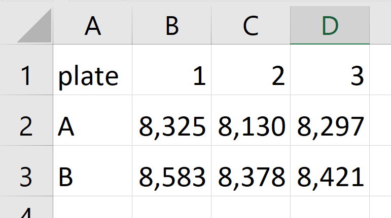
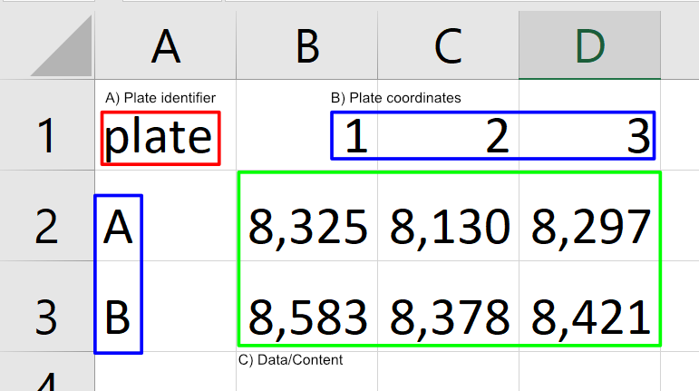

# plateR

Collection of functions for working with multi-well microtitre plates and utilities for combining data and metadata.

## Example

### Loading a plate

Loading a plate is easy. First, make a plate on the format of the image below. This data can be provided as a data frame, csv, tsv or excel file (with worksheet identifier).



To load the plate from file path `/path/to/file.xlsx`, use the following code:

```r
data <- read_plate_xlsx("/path/to/file.xlsx", 1, cols = "plate")
```

Here you are loading the excel file in folder `/path/to/`. The data loaded is in worksheet 1 with a plate identifier (See A. in image below). This field can be whatever, and is specified using `cols="identifier"`.



If you now view the variable `data`, you'll find it to be:

|    n | well |  row |  col | value |
| ---: | :--- | ---: | ---: | ----: |
|    1 | A1   |    1 |    1 |  8325 |
|    1 | A2   |    1 |    2 |  8130 |
|    1 | A3   |    1 |    3 |  8297 |
|    1 | B1   |    2 |    1 |  8583 |
|    1 | B2   |    2 |    2 |  8378 |
|    1 | B3   |    2 |    3 |  8421 |

### Combining setup and data

Assuming you have a setup file with the following content.

| setup |         1 |         2 |         3 |
| ----: | --------: | --------: | --------: |
|     A | treatment | treatment | treatment |
|     B |   control |   control |   control |

And a data file with the following content.

| data |    1 |    2 |    3 |
| ---: | ---: | ---: | ---: |
|    A |  102 |  105 |  103 |
|    B |   99 |   98 |  102 |

These files are loaded into two variables `setup` and `data`. These can be combined by `well` using the following command:

```r
df <- combine_setup_data(setup, data)
```

The combined files will now contain the following information:

|    n | well |  row |  col |     setup | data |
| ---: | :--- | ---: | ---: | --------: | ---: |
|    1 | A1   |    1 |    1 | treatment |  102 |
|    1 | A2   |    1 |    2 | treatment |  105 |
|    1 | A3   |    1 |    3 | treatment |  103 |
|    1 | B1   |    2 |    1 |   control |   99 |
|    1 | B2   |    2 |    2 |   control |   98 |
|    1 | B3   |    2 |    3 |   control |  102 |

## License

This project is licensed under `ECL-2.0`. For more details see [LICENSE](LICENSE).
